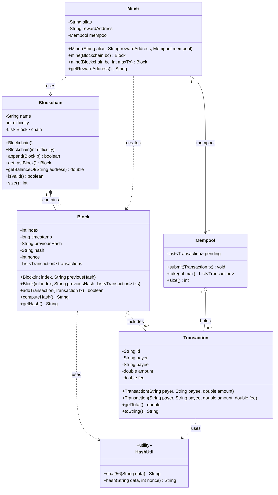

# Bitcoin Excercise

### Implementation Order

1. Transaction
2. HashUtil
3. Block
4. Blockchain
5. Mempool
6. Miner

### Class Diagram

```mermaid
classDiagram
class Transaction {
  -String id
  -String payer
  -String payee
  -double amount
  -double fee
  +Transaction(String payer, String payee, double amount)
  +Transaction(String payer, String payee, double amount, double fee)
  +getTotal() double
  +toString() String
}
class Mempool {
  -List~Transaction~ pending
  +submit(Transaction tx) void
  +take(int max) List~Transaction~
  +size() int
}
class Block {
  -int index
  -long timestamp
  -String previousHash
  -String hash
  -int nonce
  -List~Transaction~ transactions
  +Block(int index, String previousHash)
  +Block(int index, String previousHash, List~Transaction~ txs)
  +addTransaction(Transaction tx) boolean
  +computeHash() String
  +getHash() String
}
class Blockchain {
  -String name
  -int difficulty
  -List~Block~ chain
  +Blockchain()
  +Blockchain(int difficulty)
  +append(Block b) boolean
  +getLastBlock() Block
  +getBalanceOf(String address) double
  +isValid() boolean
  +size() int
}
class Miner {
  -String alias
  -String rewardAddress
  -Mempool mempool
  +Miner(String alias, String rewardAddress, Mempool mempool)
  +mine(Blockchain bc) Block
  +mine(Blockchain bc, int maxTx) Block
  +getRewardAddress() String
}
class HashUtil {
  <<utility>>
  +sha256(String data) String
  +hash(String data, int nonce) String
}
Blockchain "1" *-- "1..*" Block : contains
Block "1" o-- "0..*" Transaction : includes
Mempool "1" o-- "0..*" Transaction : holds
Miner "1" --> "1" Mempool : mempool
Miner ..> Blockchain : uses
Miner ..> Block : creates
Block ..> HashUtil : uses
Transaction ..> HashUtil : uses
```

