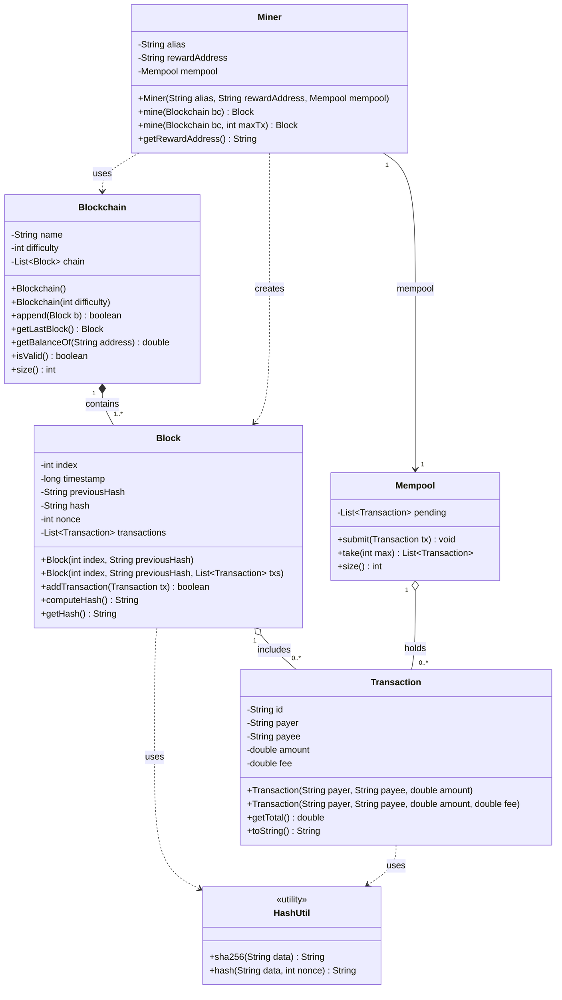

# Blockchain exercise — class diagram

## Reading the relationships

| Notation | Relationship | Where it appears | Why |
| --- | --- | --- | --- |
| filled diamond | composition | `Blockchain` — `Block` | the chain builds its own genesis block and blocks have no life outside it |
| hollow diamond | aggregation | `Mempool` / `Block` — `Transaction` | the same transaction object exists in the mempool before it is included in a block |
| solid arrow | association | `Miner` — `Mempool` | a field pointing at an object created elsewhere and shared |
| dashed arrow | dependency | `Miner` — `Blockchain` / `Block`, `Block` / `Transaction` — `HashUtil` | received as a parameter, produced as a return value, or used through a static call — never stored |

**Rule of thumb for students:** a field is an association, a parameter or local variable is a dependency. Ownership of the life cycle is what upgrades an association to aggregation or composition.

## Notes

- There is no account class. A payer or payee is just a `String` address, and a balance is computed with `Blockchain.getBalanceOf(address)` by walking every block and summing the transactions that touch it. This is roughly how Bitcoin actually works.
- Method overloading appears in three places: `Blockchain`, `Transaction`, and `Miner.mine`.
- Encapsulation is enforced through `Block`, whose `hash` and `nonce` are private and writable only by `computeHash()`, and `Blockchain.append()`, which rejects any block whose `previousHash` does not match the current tip.
